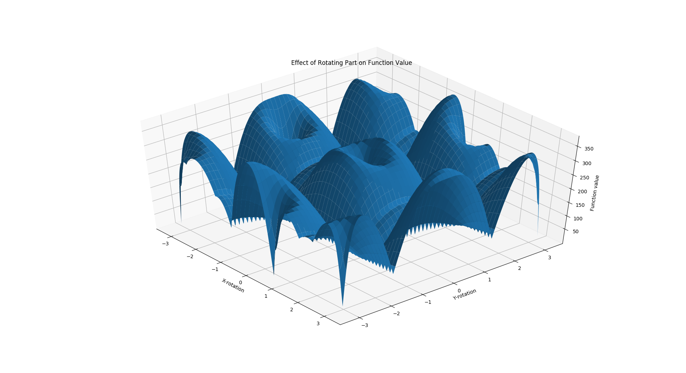

# orient-stl: MATH4630 Nonlinear Optimization Final Project

## Project Proposal

See [proposal.pdf](proposal.pdf)

## Calculations in Mathematica

To verify the correctness of my objective function, I also mostly implemented it in Mathematica. See [calculations.pdf](calculations.pdf).

## Running

### Orient an STL file

```bash
python main.py examples/cube.stl orient
```

### Plot the objective function value for an STL file

```bash
python main.py examples/cube.stl plot
```

## Demo with cut cylinder.stl

### Original part orientation


### Corrected part orientation

```bash
> python main.py examples/cut cylinder.stl orientplot
`File "examples/cut cylinder.stl" oriented with angles [-2.62 -0.  ] and value 0.12231975793838501 in 586 ms`
```


### Function value plot

```bash
> python main.py examples/cut cylinder.stl plot
Plotting function value for examples/cut cylinder.stl
Minimum value of 1.2497923374176025 found
```


